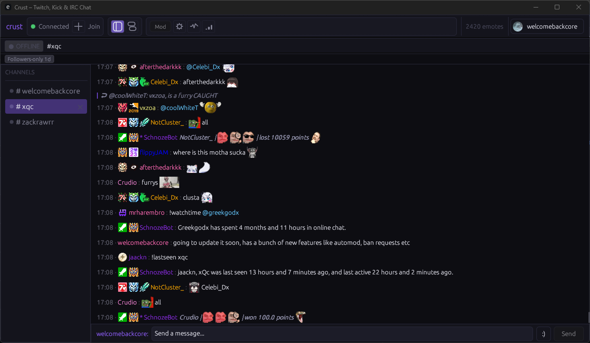
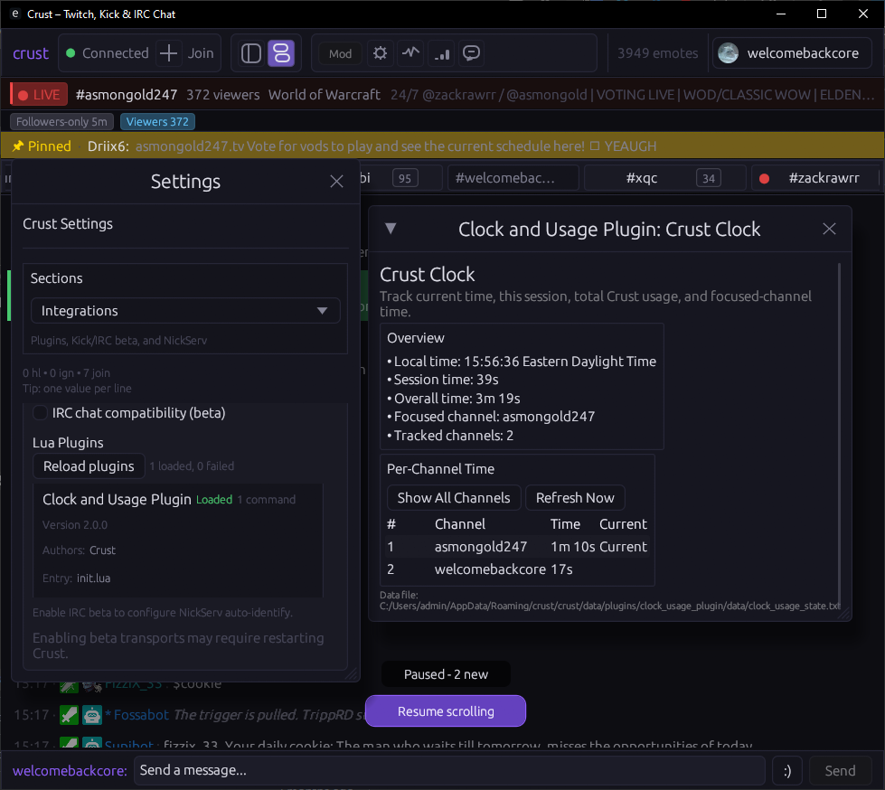
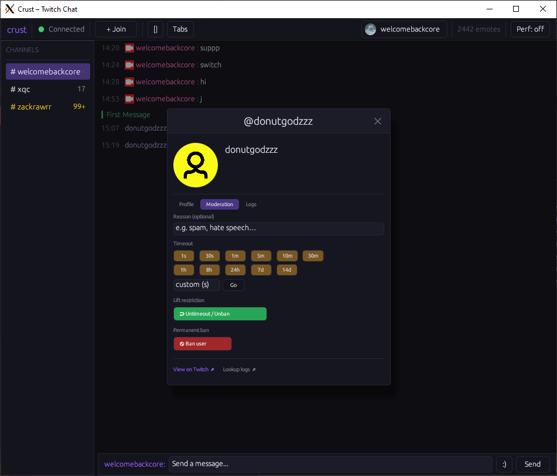
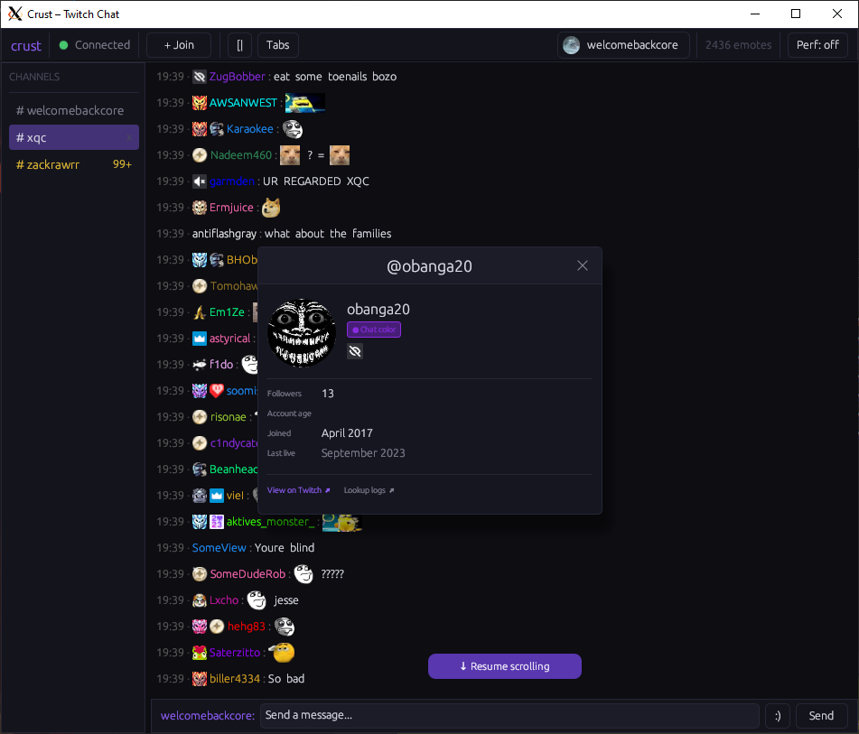
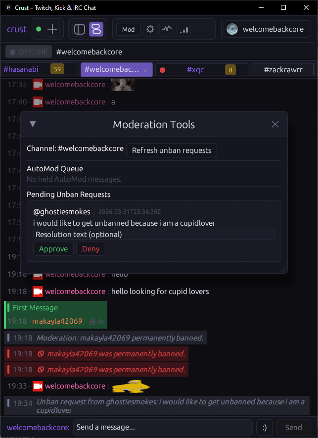

# crust

A native Twitch chat client written in Rust.

`crust` is a hobby project built as a multi-crate Rust workspace with an `egui` desktop UI, a Twitch IRC/WebSocket session layer, emote provider integrations, and local settings/log storage.

## Screenshots











## Current status

Active early-stage project. The app builds and runs, and core chat workflows are in place. APIs and internals may still change.

## Reference baseline

crust uses `chatterino2-master` as the default north-star baseline for feature behavior and bug-fix outcomes.

When `chatterino2-master` and `chatterino7-chatterino7` differ, crust prefers `chatterino2-master`.

See:

- [docs/REFERENCE_POLICY.md](docs/REFERENCE_POLICY.md)
- [docs/ARCHITECTURE.md](docs/ARCHITECTURE.md)
- [CONTRIBUTING.md](CONTRIBUTING.md)

## Features

- Twitch IRC over WebSocket - anonymous and authenticated modes
- Multi-channel tabs - join, leave, reorder channels
- Multi-account support - add, switch, remove, and set a default account
- Message rendering:
  - Twitch native emotes
  - Third-party emotes: BTTV, FFZ, 7TV (global + channel + personal sets)
  - Animated emote support (GIF, WebP)
  - Emoji tokenization via Twemoji URLs
  - Badge rendering (global + channel badges via IVR)
  - URL and @mention detection
  - Highlighted and first-message indicators
- Emote picker and `:` autocomplete with Tab completion
- Reply flow (threaded replies)
- Basic moderation: timeout, ban, unban
- User profile popup with avatar, badges, account metadata, and recent messages
- Link preview metadata fetch (Open Graph / Twitter card)
- Message input history (arrow-key recall)
- Local settings persistence and optional keyring-backed token storage
- Per-channel append-only chat logs
- Chat history on join (via recent-messages.robotty.de / IVR fallback)

## Workspace layout

- `crates/app` - binary entrypoint, runtime wiring, reducer/event loop
- `crates/ui` - `egui` application and widgets
- `crates/core` - shared domain models, events, tokenizer/highlight/state
- `crates/twitch` - IRC parser + Twitch session client/reconnect/rate limiting
- `crates/emotes` - provider loaders and image cache (memory + disk)
- `crates/storage` - settings/token + log storage

## Requirements

- Rust stable toolchain (edition 2021)
- Cargo
- Linux desktop dependencies for `eframe`/`winit` (X11 or Wayland)

## Build and run

From the workspace root:

```bash
cargo check
cargo run -p crust
```

Release build:

```bash
cargo run -p crust --release
```

### Windows release binary

Build and package a Windows release zip from PowerShell:

```powershell
powershell -ExecutionPolicy Bypass -File .\scripts\build_windows_release.ps1
```

Artifacts are produced at:

- `target\\release\\crust.exe`
- `dist\\windows\\crust-v0.1.0-windows-x64.zip`

### Running on WSL

Requires VcXsrv launched with the `-wgl` flag (or "Native opengl" checked in XLaunch) to expose GLX framebuffer configs. Mesa version overrides are needed to negotiate a valid OpenGL context:

```bash
export DISPLAY=172.17.128.1:0.0  # replace with your host IP - check /etc/resolv.conf nameserver
export MESA_GL_VERSION_OVERRIDE=3.3
export MESA_GLSL_VERSION_OVERRIDE=330
export WINIT_UNIX_BACKEND=x11
unset WAYLAND_DISPLAY
cargo run -p crust --release
```

**WSLg (Windows 11)** - works out of the box with Wayland, no X server or overrides needed:

```bash
cargo run -p crust --release
```

## Authentication

- Anonymous mode works for read-only chat.
- To send messages, log in with a Twitch OAuth token in-app.
- Multiple accounts are supported - switch accounts without restarting.
- Token storage uses the OS keyring when available, with a settings-file fallback.

## Data paths

Using platform-specific app dirs via `directories::ProjectDirs` (typically):

- Config: `~/.config/crust/settings.toml`
- Cache: `~/.cache/crust/emotes/`
- Logs: `~/.local/share/crust/logs/`

## License

This project is licensed under GNU GPL v3.0. See [LICENSE](LICENSE).
