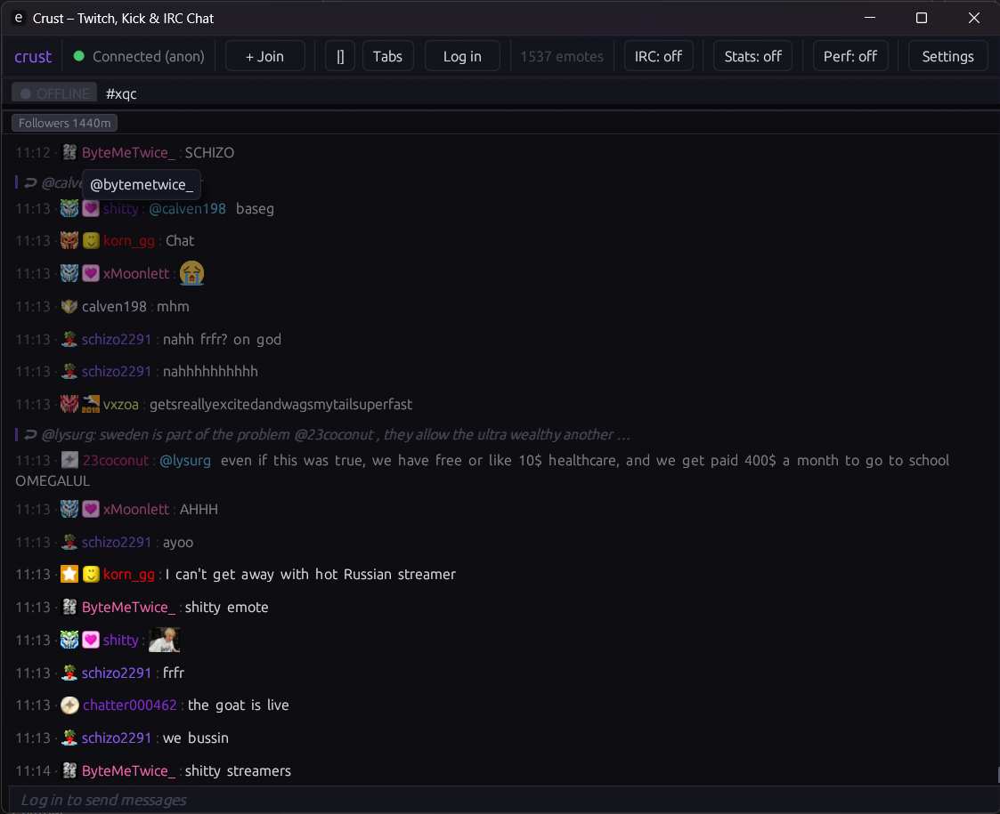

# crust

A native Twitch + Kick + IRC chat client written in Rust.

`crust` is a hobby project inspired by Chatterino, built as a multi-crate Rust workspace with an `egui` desktop UI, Twitch/Kick/IRC session layers, emote/badge integrations, and local settings/log storage.

## Screenshots




## Current status

Active early-stage project. The app builds and runs, and core chat workflows are in place. APIs and internals may still change.

## Features

- **Connectivity and session support**
  - **Twitch IRC (WebSocket):** supports both anonymous read-only sessions and authenticated sessions.
  - **Kick chat transport:** receives chat over Pusher; current implementation is read-only.
  - **Generic IRC:** supports plain and TLS server targets via `irc://host[:port]/channel` and `ircs://host[:port]/channel`.
  - **Multi-channel workflow:** join, leave, reorder, and switch between Twitch, Kick, and IRC tabs.
  - **Multi-account Twitch auth:** add accounts, switch active account, remove accounts, and set a default auto-login account.

- **Message rendering and media pipeline**
  - **Native + third-party emotes:** Twitch native emotes plus BTTV/FFZ/7TV global/channel/personal sets.
  - **Kick emote rendering:** uses Kick-native data with inline tag fallback when needed.
  - **Animated image support:** GIF and WebP emotes are decoded and rendered in the UI.
  - **Emoji tokenization:** emoji are normalized through Twemoji URL mapping.
  - **Badge support:** Twitch global/channel badges (IVR) and Kick badge images (with API fallback path).
  - **Rich parsing:** URL detection, @mention detection, first-message/highlight indicators.
  - **Link metadata preview:** Open Graph/Twitter card title/description/thumbnail fetch and display.

- **Input and moderation UX**
  - **Slash command autocomplete:** type `/` to browse commands; supports keyboard navigation and accept.
  - **Emote autocomplete:** supports `:`-style completion and Tab cycling.
  - **Message history recall:** Up/Down navigates previously submitted input.
  - **Reply flow:** in-input reply banner + message reply metadata forwarding.
  - **Moderation actions:** timeout, ban, and unban tools in supported contexts.
  - **User profile popup:** account metadata, avatar, badges, and recent messages (Twitch + Kick).
  - **Anonymous restrictions:** anonymous users can execute local slash commands, but plain chat messages are not sent.

- **Persistence, storage, and startup behavior**
  - **Settings + credentials:** app settings persisted locally; token storage uses OS keyring when available, file fallback otherwise.
  - **Per-channel logs:** append-only channel logs written to local storage.
  - **Startup preload:** history loading on join (`recent-messages.robotty.de` / IVR fallback), emote catalog hydration, and image prefetch.

## Workspace layout

- `crates/app` - binary entrypoint, runtime wiring, reducer/event loop
- `crates/ui` - `egui` application and widgets
- `crates/core` - shared domain models, events, tokenizer/highlight/state
- `crates/twitch` - IRC parser + Twitch session client/reconnect/rate limiting
- `crates/kick` - Kick session client (Pusher), channel metadata and chat event parsing
- `crates/emotes` - provider loaders and image cache (memory + disk)
- `crates/storage` - settings/token + log storage

## Requirements

- Rust stable toolchain (edition 2021)
- Cargo
- Linux desktop dependencies for `eframe`/`winit` (X11 or Wayland), or
- Windows C++ build tools (MSVC toolchain)

## Build and run

From the workspace root:

```bash
cargo check
cargo run -p crust
```

Release build:

```bash
cargo run -p crust --release
```

### Performance testing

Lightweight performance tests are available as ignored test cases (so they
don't run in normal `cargo test`):

```bash
cargo test -p crust-core --release perf_ -- --ignored --nocapture
cargo test -p crust-twitch --release perf_ -- --ignored --nocapture
```

These print simple throughput metrics (ops/sec) for tokenization/highlighting
and Twitch IRC parsing hot paths.

Replay soak test (ignored by default):

```bash
CRUST_SOAK_RATE=200 CRUST_SOAK_SECS=900 \
  cargo test -p crust-twitch --release replay_soak_ -- --ignored --nocapture
```

PowerShell:

```powershell
$env:CRUST_SOAK_RATE=200
$env:CRUST_SOAK_SECS=900
cargo test -p crust-twitch --release replay_soak_ -- --ignored --nocapture
```

Soak-test performance indicators (printed at the end of the run):

- `ratio` should stay close to `1.000` (consumer keeping up with producer)
- `parse_errors` should be `0`
- `final_backlog` should return to `0` (or near-zero)
- `max_backlog` should stay small and stable (no unbounded growth)
- `max_frame_work_ms` should remain low; lower values indicate better per-frame headroom

Example healthy output:

```text
[soak] done: produced=179999, consumed=179999, ratio=1.000, parse_errors=0, max_backlog=9, final_backlog=0, peak_frame_processed=9, max_frame_work_ms=1.529
```

### Windows (native)

You can build and run `crust` directly on Windows with Cargo.

Install prerequisites with Chocolatey (PowerShell **as Administrator**):

```powershell
choco install -y rustup.install visualstudio2022buildtools visualstudio2022-workload-vctools git
rustup default stable-x86_64-pc-windows-msvc
```

Then build/run from the repo root:

```powershell
cargo check
cargo run -p crust
```

Release:

```powershell
cargo run -p crust --release
```

If you hit linker errors like `LNK1318` (PDB/file-system limits), free disk space and retry (or run `cargo clean` first).

### Running on WSL

Requires VcXsrv launched with the `-wgl` flag (or "Native opengl" checked in XLaunch) to expose GLX framebuffer configs. Mesa version overrides are needed to negotiate a valid OpenGL context:

```bash
export DISPLAY=172.17.128.1:0.0  # replace with your host IP - check /etc/resolv.conf nameserver
export MESA_GL_VERSION_OVERRIDE=3.3
export MESA_GLSL_VERSION_OVERRIDE=330
export WINIT_UNIX_BACKEND=x11
unset WAYLAND_DISPLAY
cargo run -p crust --release
```

**WSLg (Windows 11)** - works out of the box with Wayland, no X server or overrides needed:

```bash
cargo run -p crust --release
```

## Authentication

- Anonymous mode works for read-only chat.
- To send messages, log in with a Twitch OAuth token in-app.
- Multiple accounts are supported - switch accounts without restarting.
- Token storage uses the OS keyring when available, with a settings-file fallback.
- Kick currently runs in read-only mode (sending messages to Kick is not yet implemented).

## Joining channels

- Twitch: `channelname` or `twitch:channelname`
- Kick: `kick:channelname`
- IRC: `irc://host[:port]/channel` or `ircs://host[:port]/channel`

## Commands (Detailed Reference)

### Command execution model

- Commands are entered in the chat box as slash commands (for example: `/help`).
- If a command is handled by crust locally, it executes immediately in the UI.
- If not handled locally, it may be forwarded to the active backend (Twitch IRC or generic IRC), depending on channel type and auth state.

### Anonymous mode behavior

- Anonymous users can type in the input and run **local** slash commands.
- Anonymous users cannot send plain chat messages.
- Slash commands that require backend/server-side execution are blocked in anonymous mode and replaced with a local explanatory notice.

### Local commands (work in anonymous mode)

- `/help` - prints the built-in command guide in chat.
- `/clearmessages` - clears the current channel view locally (visual clear only).
- `/chatters` - prints the current tracked chatter count for the active channel.
- `/fakemsg <text>` - injects a local system message (never sent to Twitch/Kick/IRC).
- `/openurl <url>` - opens a URL in the system browser.
- `/popout [channel]` - opens Twitch/Kick popout chat URL in browser (channel-dependent).
- `/user <user>` - opens Twitch/Kick profile URL in browser (in IRC tabs, `/user` is protocol-level and not local).
- `/usercard <user>` - opens crust's in-app user profile card popup.
- `/streamlink [channel]` - opens a `streamlink://` URL for Twitch channels.

### IRC-focused commands

These are intended for IRC tabs. Some are parsed client-side for convenience, while others are forwarded to the IRC server.

- Connection/session helpers:
  - `/server <host[:port]>` (alias: `/connect`) - open/connect an IRC server tab.
  - `/join <#channel> [key]` - join/create a channel on the current IRC server.
  - `/part [#channel]` - leave current/specified IRC channel.
  - `/nick <name>` - set nickname for generic IRC servers.
  - `/pass <password>` - set IRC server password (applied on reconnect).
  - `/quit [message]` - disconnect from current IRC server.

- Typical IRC protocol commands (forwarded to backend/server):
  - `/msg <target> <text>`
  - `/notice <target> <text>`
  - `/topic [#channel] [text]`
  - `/names [#channel]`
  - `/list [mask]`
  - `/mode <target> [modes]`
  - `/kick <#channel> <nick> [reason]`
  - `/invite <nick> [#channel]`
  - `/whois <nick>`
  - `/who [mask|#channel]`
  - `/away [message]`
  - `/raw <line>`

- Raw IRC shortcut:
  - In IRC tabs, uppercase protocol lines such as `PRIVMSG #rust :hello` are sent as raw IRC lines.

### Twitch-focused commands

- `/w <user> <msg>` and `/whisper <user> <msg>` - send Twitch whispers.
- `/banid <id>` - convenience shorthand that forwards to `/ban <id>`.
- Standard Twitch IRC moderation/utility commands (for example `/ban`, `/timeout`, `/slow`, `/clear`) are generally forwarded to Twitch when logged in.

### Kick command notes

- Kick chat is currently read-only in crust.
- URL/profile helpers (for example `/popout`, `/user`) may still open browser targets for Kick channels.

## Notes

- Kick profile lookups use Kick public APIs. If a profile endpoint is temporarily unavailable/forbidden, the app falls back to a minimal profile card instead of hanging on loading.

## Data paths

Using platform-specific app dirs via `directories::ProjectDirs` (typically):

- Config: `~/.config/crust/settings.toml`
- Cache: `~/.cache/crust/emotes/`
- Logs: `~/.local/share/crust/logs/`

## License

This project is licensed under GNU GPL v3.0. See [LICENSE](LICENSE).
